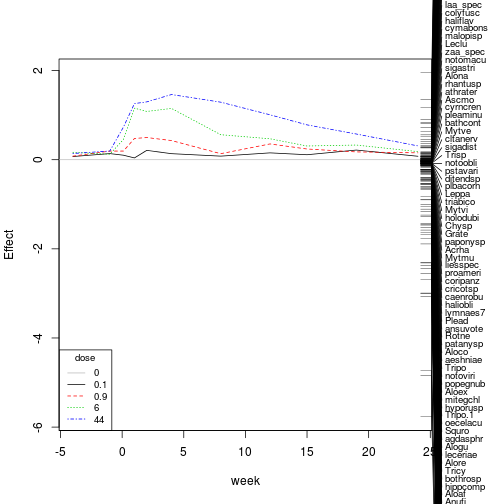

In my first post I want to reproduce the results of:

***Van den Brink, P. J. & Braak, C. J. F. . Principal response curves: Analysis of time-dependent multivariate responses of biological community to stress. Environmental Toxicology and Chemistry 18, 138–148 (1999).***


Principle Response Curves (PRC) are commonly used for analyzing ecotoxicological mesocosm experiments. 
Here I will show how to run such an analysis with R.
I won't dig in the mathematics behind it, so this is up to the reader.


The data comes with the vegan package which we will also use for the PRC:


```r
require(vegan)
data(pyrifos)
head(pyrifos[, c(1:10)])
```

```
##        Simve Daplo Cerpu Alogu Aloco Alore Aloaf Copsp Ostsp Slyla
## w.4.c1 3.951     0     0     0     0     0     0 2.773 0.000 1.386
## w.4.c2 2.303     0     0     0     0     0     0 2.079 0.000 0.000
## w.4.c3 4.595     0     0     0     0     0     0 3.761 0.000 0.693
## w.4.c4 2.398     0     0     0     0     0     0 3.296 0.693 0.000
## w.4.c5 4.025     0     0     0     0     0     0 3.466 0.000 0.000
## w.4.c6 2.303     0     0     0     0     0     0 2.197 0.000 0.000
```


So rows are samplings and colums are the species (with abbreviated names), a normal species x sites matrix.
The colnames code treatment and time, but we must create these two factors:


```r
# time
week <- gl(11, 12, labels = c(-4, -1, 0.1, 1, 2, 4, 8, 12, 15, 19, 24))
# treatment
dose <- factor(rep(c(0.1, 0, 0, 0.9, 0, 44, 6, 0.1, 44, 0.9, 0, 6), 11))
```


With this at hand we can calculate and plot the PRC using the prc function:

```r
pyr_prc <- prc(response = pyrifos, treatment = dose, time = week)
plot(pyr_prc)
```

 


This comes quite near to Figure 3 in the paper, except some scaling on the y-Axis and all the species scores are displayed.

Man, that was complicated...
In Figure 3 they ploted only the species with scores greater than 0.5 or less then -0.5.
We can access the species scores with the summary function:


```r
sum_prc <- summary(pyr_prc)
# Species scores:
sum_prc$sp
```


```r
head(sum_prc$sp)
```

```
##    Simve    Daplo    Cerpu    Alogu    Aloco    Alore 
## -1.46193 -0.79651 -0.29517 -0.15230 -0.09627 -0.17133
```


And then select only those species with greater or less scores:


```r
plot(pyr_prc, select = abs(sum_prc$sp) > 0.5)
```

 


OK, thats it for now. I think in following posts I will reproduced their tables and also show alternatives to the Principle Response Curves.


