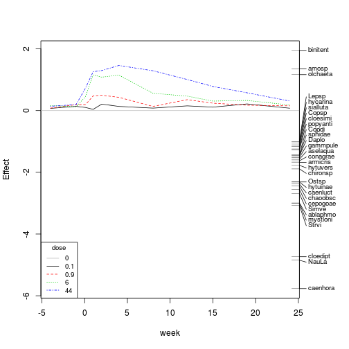

OK, so in the first post we saw that it is quite easy to calculate Principle Response Curves in R.

How are these interpreted?


 


These plot shows on the x-Axis the time and on the y-Axis the difference from the control treatments.
The farther apart from the x-Axis the more different are the communities compared to the control.

We see a clearly treatment-related effect: After application at time 0 the treated communities rapidly change treatment dependent.
However to the end of the experiment the treated and the control get similar again, which we may call 'recovery'.

On the right side we see the species names. This shows the contribution of the species to this plot.

For example ceanhora (=*Caenis horaria*) has the lowest weight (~-3), so this species decreases the most after application. binitent(=*Bithynia tentaculata*) has a positive weight and abundance increases slightly.

Let´s move back to the paper and the tables therein:
Table 1 contains the proportions of variance that can be attributed to Time and Treatment.
We can extract this information if we just print the prc-object:


```r
pyr_prc
```

```
## Call: prc(response = pyrifos, treatment = treatment, time = time)
## 
##               Inertia Proportion Rank
## Total         288.992      1.000     
## Conditional    63.349      0.219   10
## Constrained    96.684      0.335   44
## Unconstrained 128.959      0.446   77
## Inertia is variance 
## 
## Eigenvalues for constrained axes:
##   RDA1   RDA2   RDA3   RDA4   RDA5   RDA6   RDA7   RDA8   RDA9  RDA10 
## 25.282  8.297  6.044  4.766  4.148  3.857  3.587  3.334  3.087  2.551 
##  RDA11  RDA12  RDA13  RDA14  RDA15  RDA16  RDA17  RDA18  RDA19  RDA20 
##  2.466  2.209  2.129  1.941  1.799  1.622  1.579  1.440  1.398  1.284 
##  RDA21  RDA22  RDA23  RDA24  RDA25  RDA26  RDA27  RDA28  RDA29  RDA30 
##  1.211  1.133  1.001  0.923  0.862  0.788  0.750  0.712  0.685  0.611 
##  RDA31  RDA32  RDA33  RDA34  RDA35  RDA36  RDA37  RDA38  RDA39  RDA40 
##  0.584  0.537  0.516  0.442  0.417  0.404  0.368  0.340  0.339  0.306 
##  RDA41  RDA42  RDA43  RDA44 
##  0.279  0.271  0.205  0.179 
## 
## Eigenvalues for unconstrained axes:
##   PC1   PC2   PC3   PC4   PC5   PC6   PC7   PC8 
## 17.16  9.19  7.58  6.06  5.73  4.84  4.52  4.10 
## (Showed only 8 of all 77 unconstrained eigenvalues)
```


Since a prc is a special case of a rda model

```r
rda(response ~ treatment * time + Condition(time))
```

so *Conditional* refers in this output to time and *Constrained* to treatment and its interaction with time.

Looking at inertia we see that time explains 22% and treatment (+ the interaction with time) 33% of variance.


The second part of this table is a little harder:
Either we refit the model with rda() as above and look at the summary where this information is displayed, or we dig a little in the object returned by prc().

This object is quite big with a lot of information in it, for more information see ?cca.object.
The eigenvalues are stored in pyr_prc$CCA$eig and to get the explained variance per axis we need to divide these eigenvalues by their sum:


```r
pyr_prc$CCA$eig/sum(pyr_prc$CCA$eig)
```

```
##     RDA1     RDA2     RDA3     RDA4     RDA5     RDA6     RDA7     RDA8 
## 0.261495 0.085815 0.062515 0.049297 0.042904 0.039891 0.037105 0.034484 
##     RDA9    RDA10    RDA11    RDA12    RDA13    RDA14    RDA15    RDA16 
## 0.031933 0.026388 0.025510 0.022847 0.022018 0.020075 0.018604 0.016773 
##    RDA17    RDA18    RDA19    RDA20    RDA21    RDA22    RDA23    RDA24 
## 0.016328 0.014897 0.014464 0.013279 0.012524 0.011724 0.010354 0.009546 
##    RDA25    RDA26    RDA27    RDA28    RDA29    RDA30    RDA31    RDA32 
## 0.008921 0.008151 0.007754 0.007367 0.007082 0.006320 0.006045 0.005553 
##    RDA33    RDA34    RDA35    RDA36    RDA37    RDA38    RDA39    RDA40 
## 0.005336 0.004568 0.004317 0.004174 0.003804 0.003514 0.003508 0.003160 
##    RDA41    RDA42    RDA43    RDA44 
## 0.002884 0.002807 0.002116 0.001852
```


So the first axis explains 26% and the second 8.6% of variance.

As a side note:

```r
pyr_prc$CCA$tot.chi/pyr_prc$tot.chi
pyr_prc$pCCA$tot.chi/pyr_prc$tot.chi
```

would return the explained variances by treatment and treatment from above.


The first (displayed) axis can also be tested for 'significance' using a permutation test:


```r
anova(pyr_prc, strata = time, first = TRUE, perm.max = 1000)
```

```
## Permutation test for rda under reduced model
## Permutations stratified within 'time'
## 
## Model: prc(response = pyrifos, treatment = treatment, time = time)
##          Df   Var    F N.Perm Pr(>F)   
## RDA1      1  25.3 15.1    199  0.005 **
## Residual 77 129.0                      
## ---
## Signif. codes:  0 '***' 0.001 '**' 0.01 '*' 0.05 '.' 0.1 ' ' 1
```

which gives the significance of the first PRC-axis (cf. Table 2).


Table 2 gives also the period of significant influence of the treatment:
Van den Brink and Ter Braak did this using Monte Carlo permutation tests per sampling date, using the natural log-transformed nominal dose as the explanatory variable. 

Of course this can also be done in R ;)

First we need to transform the treatment dose:

```r
ln_treatment <- log(20 * as.numeric(as.character(treatment)) + 1)
```


And then we run a permutation test (via anova.cca) per sampling date:

```r
out <- NULL
for (i in levels(time)) {
    take_spec <- pyrifos[time == i, ]
    take_treatment <- ln_treatment[time == i]
    out[[i]] <- anova(rda(take_spec ~ take_treatment), by = "terms", step = 1000)
}
sapply(out, function(x) x[1, 5])  # grabs the p-values per date
```

```
##    -4    -1   0.1     1     2     4     8    12    15    19    24 
## 0.426 0.894 0.010 0.001 0.001 0.001 0.005 0.002 0.036 0.023 0.171
```

I am looping through time and for every sampling week I run a permutation test on a RDA. The results are in accordance with Table 2: there is a statistically significant effect of treatment from week 0.1 till week 19.

Besides the overall significance of treatment, they also looked which treatments differed from control in order to get a no-observed-effect Concentration (NOEC) [=the concentration below the lowest significant concentration]. 

Testing by permutation fails here, because there are not enough unique permutations (we have only 2 treated and 4 controls per sampling date).
Therefore they applied a Williams Test [1] on the first principle component of a PCA on each sampling date.

This is a little bit more challenging, since we need to compute a PCA, extract the scores and the run a Williams-Test on these. I could not find any reference how to run the cited Williams Test in R (if anyone has a hint give me a note!).

Instead of using a trend-test we could use Dunnett-Contrasts - Comparing every treatment to the control. However this approach has less power.

I R we could do something like this:


```r
df <- data.frame(treatment = treatment, time = time)
# package for multiple comparisons
require(multcomp)
```

```
## Loading required package: multcomp
```

```
## Loading required package: mvtnorm
```

```
## Loading required package: survival
```

```
## Loading required package: splines
```

```r
# create empty object
out_willi <- NULL
# loop through time, compute PCA, extract scores and do Williams-Test
for (i in levels(time)) {
    pca <- rda(pyrifos[time == i, ])  # Compute PCA
    pca_scores <- scores(pca, display = "sites", choices = 1)  # scores of first principle component
    
    out_willi[[i]] <- summary(glht(aov(pca_scores ~ treatment, data = df[time == 
        i, ]), alternative = "t", linfct = mcp(treatment = "Dunnett")))
}
# extract p-values
result <- lapply(out_willi, function(x) data.frame(comp = levels(df$treatment)[-1], 
    pval = x$test$pvalues, sig = x$test$pvalues < 0.05))
# shows the results of Williams-Test on PCA-scores for week 1:
result[["1"]]
```

```
##   comp     pval   sig
## 1  0.1 0.999857 FALSE
## 2  0.9 0.060847 FALSE
## 3    6 0.001974  TRUE
## 4   44 0.001182  TRUE
```


So we run through time, via a for-loop. For every time-point we compute a PCA and extract the scores. Then we run the Dunnett contrasts with the multcomp package. Finally we extract our results.

As we see, we get a different result then in the paper. Here our NOEC would be 0.9 $\mu g/L$. But I think this can be attributed to the lower power of Dunnetts test.
 

OK, so now we are finished with Principle Response Curves. Of course there are a lot more possibilities to analyze such data sets. My next posts will probably show some alternatives to PRC: SPEAR, mvabund and control charts.


Of course I can´t (and don´t want) give any warranty on the correctness of these blog entries. 
So be critical! 


```
[1] Williams DA. 1972. The comparison of several dose levels with
a zero dose control. Biometrics 28:519–531.
```


