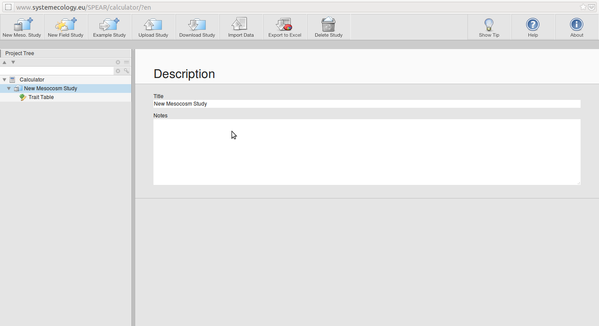
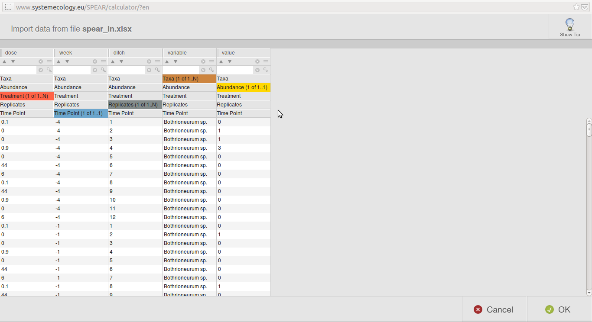

Recently Liess & Beketov, (2011) proposed a new method to analyze mesocosm data: SPEARmesocosm. 

The tool to calculate SPEAR values is freely available as webapplication at http://www.systemecology.eu/SPEAR. 
So in this blog I will show how we can use this tool to analyse a mesocosm experiment:


As in the last post we first load the data and the packages we will need:

```r
require(vegan)  # for the data
require(xlsx)  # writing to .xls
require(gdata)  # read.xls (don't know why read.xlsx doesn't work)
require(RCurl)  # to read .csv from github
require(reshape2)  # tranform data formats (long / wide)
require(plyr)  # aggregate and transform data
require(ggplot2)  # graphics


# pyrifos data
data(pyrifos)

# The data has been log-transformed, we want to use the raw abundances:
pyrifos <- round((exp(pyrifos) - 1)/10)

# create treatment, time and ditch factors
pyrifos$week <- gl(11, 12, labels = c(-4, -1, 0.1, 1, 2, 4, 8, 12, 15, 19, 24))
pyrifos$dose <- factor(rep(c(0.1, 0, 0, 0.9, 0, 44, 6, 0.1, 44, 0.9, 0, 6), 
    11))
pyrifos$ditch <- gl(12, 1, length = 132)
```


SPEAR-calculator accepts only data in the long format, we can use melt() to bring data from the wide into the long format:

```r
# bring data to long format
pyrifos_melt <- melt(pyrifos, id = c("dose", "week", "ditch"))
```


SPEARmesocosm incorporates species traits into the analysis. It compares the taxa if they are classified as SPEcies At Risk or not. Therefore we need complete taxanames. Unfortunately the data available in vegan contains only abbreviated taxanames. I tried to recover the names from the abbreviations, but was not successful for all of the species. I prepared a table to replace the abbreviations with real taxanames:

```r
# get lookup table for taxa-names from my github repository
csv <- getURL("https://raw.github.com/EDiLD/r-ed/master/post4_prcSPEAR/taxa_names.csv")
taxa_names <- read.table(textConnection(csv), header = TRUE, sep = ";")

# replace taxa names
pyrifos_melt$variable <- taxa_names$taxa[match(pyrifos_melt$variable, taxa_names$abbrv)]

# remove unmatched names
pyrifos_melt <- pyrifos_melt[!is.na(pyrifos_melt$variable), ]
```

No our data is ready and we have to export it as Excel-file to use it with the SPEAR calculator.


```r
# write to xls
write.xlsx2(pyrifos_melt, file = "spear_in.xlsx", row.names = FALSE)
```


Now we start the [SPEAR-calculator](http://www.systemecology.eu/SPEAR), start a new Mesocosm Study and import our data which is in spear_in.xlsx.

The we must select the colums coding taxa, abundance, treatment, timing and replicates:

And that´s it: You can browse through the results in the calculator, but also export the results.
Since we want to make some nice plots (and perhabs some statistical tests) we export the results to our working directory and name the file 'spear_out.xls'.


```r
# read xls from SPEAR-calculator
spear <- read.xls("spear_out.xls", sheet = 3)
spear$Treatment <- factor(spear$Treatment)
```


Having the data in R we can make some plots, for example with ggplot2:
* SPEAR against time for all replicates:


```r
# plot raw
p <- ggplot(spear, aes(x = Time.Point, y = SPEARpesticides, col = Treatment)) + 
    geom_point() + geom_line(aes(group = Replicates)) + xlab("Weeks")
p
```

 


* Hmm, so many lines... We can plot also only the mean SPEARvalues per treatment and time


```r
# plot means
spear_means <- ddply(spear, .(Treatment, Time.Point), summarise, mean_spear = mean(SPEARpesticides))

p2 <- ggplot(spear_means, aes(x = Time.Point, y = mean_spear, col = Treatment)) + 
    geom_point() + geom_line() + xlab("Weeks") + ylab("SPEARpesticides")
p2
```

 


* Or, to get a plot similar to the Principle Response Curves: Plot the difference in SPEAR to the control:

```r
# plot difference to control
spear_relcont <- ddply(spear_means, .(Time.Point), transform, mean_spear = mean_spear - 
    mean_spear[Treatment == 0])

p3 <- ggplot(spear_relcont, aes(x = Time.Point, y = mean_spear, col = Treatment)) + 
    geom_point() + geom_line() + xlab("Weeks") + ylab(expression(paste(Delta, 
    "SPEARpesticides")))
p3
```

 


**Refs**
<p>Liess M and Beketov M (2011).
&ldquo;Traits And Stress: Keys to Identify Community Effects of Low Levels of Toxicants in Test Systems.&rdquo;
<EM>Ecotoxicology</EM>, <B>20</B>.
ISSN 0963-9292, <a href="http://dx.doi.org/10.1007/s10646-011-0689-y">http://dx.doi.org/10.1007/s10646-011-0689-y</a>.
<p>Liess M and Beketov M (2011).
&ldquo;Traits And Stress: Keys to Identify Community Effects of Low Levels of Toxicants in Test Systems.&rdquo;
<EM>Ecotoxicology</EM>, <B>20</B>.
ISSN 0963-9292, <a href="http://dx.doi.org/10.1007/s10646-011-0689-y">http://dx.doi.org/10.1007/s10646-011-0689-y</a>.


