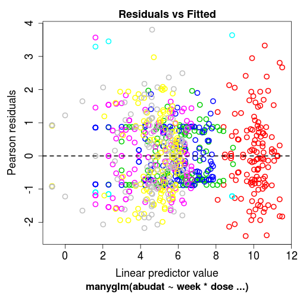
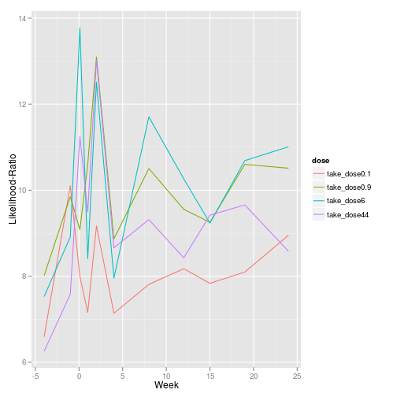

OK, as far I showed how to use Principle Response Curves (PRC) and SPEARmesocosm to analyze mesocosm data.
In this post I`ll show a third method, which to my knowledge has not been used yet for mesocosm-studies.

Its implemented in the the [mvabund-package](http://onlinelibrary.wiley.com/doi/10.1111/j.2041-210X.2012.00190.x/full) and fits Generalized Linear Models to multivariate abundance data. As the developers (Warton _et. al._ 2012) showed mvabund has a greater statistical power than RDA. The only drawback that I see, is that mvabund is very computer intensive (but computers are getting faster and faster...).

I skip the data and package loading Code, just look in the previous posts...
Since mvabund is so computer-intensive I`ll only use a subset (100 species with max. abundance) of species for demonstration:

```r
take <- pyrifos[, order(apply(pyrifos[week == -1, ], 2, max), decreasing = TRUE)[1:100]]
```


First we have to create a mvabund-object from our abundance data:

```r
require(mvabund)
abudat <- mvabund(take)
```


And then we can run a multivariate glm with R formula interface:

```r
mod1 <- manyglm(abudat ~ week * dose, family = "n")
```

Fits glms with a negative-binomial error distribution to the abundances.
We can investigate the residuals, and look at obvious patters:

```r
plot(mod1)
```

 

Alternative error distributions are:
* Poisson
* Gaussian
* Binomial

We can test the terms using the anova method:

```r
aov_mod1 <- anova(mod1)
```


```r
aov_mod1
```

```
## Analysis of Deviance Table
## 
## Model: manyglm(formula = abudat ~ week * dose, family = "n")
## 
## Multivariate test:
##             Res.Df Df.diff   Dev Pr(>Dev)    
## (Intercept)    131                           
## week           121      10 11032   <2e-16 ***
## dose           117       4  3482   <2e-16 ***
## week:dose       77      40  6467     0.01 ** 
## ---
## Signif. codes:  0 '***' 0.001 '**' 0.01 '*' 0.05 '.' 0.1 ' ' 1 
## Arguments:
##  Test statistics calculated assuming uncorrelated response (for faster computation) 
##  P-value calculated using 999 resampling iterations via pit.trap resampling (to account for correlation in testing).
```

As expected we have statistically significant interaction between dose and time. 
These computations took on my Laptop (Intel® Core™ i5 CPU M 430 @ 2.27GHz × 4, 4 GB Memory) 1433 seconds (~24 Minutes).

We can also now test the treatment effect per week. Here I perform the analysis for every week separately, a nicer solution would be to work with contrast...


```r
out <- NULL
for (i in levels(week)) {
    take_spec <- abudat[week == i, ]
    take_dose <- dose[week == i]
    mod <- manyglm(take_spec ~ take_dose)
    out[[i]]$summary <- summary(mod, test = "LR", p.uni = "adjusted")
    out[[i]]$fitted <- fitted(mod)
}
```

This is the same as in the previous posts: for every week take the respective data and run the model, afterwards save the output into a list.


Then we can inspect every week separately, looking at the respective list entry:

```r
out[[5]]
```

The output is quite numerous and I do not show it here:
First we see as in the globalk test the effect of our treatment, but then we see also tests for every species.
This is quite useful, since we see directly (like the PRC-Scores) which species are responsible for the difference!

From this list object, we could write acessor-functions to get data we are interessted in out of the list:

Here is one to extract the p-values and put them into a data.frame:

```r
do.call(rbind, lapply(out, function(x) x$summary$coefficients[, 2]))
```

```
##     (Intercept) take_dose0.1 take_dose0.9 take_dose6 take_dose44
## -4        0.001        0.358        0.236      0.446       0.305
## -1        0.001        0.097        0.137      0.420       0.150
## 0.1       0.001        0.202        0.180      0.055       0.009
## 1         0.001        0.416        0.089      0.064       0.087
## 2         0.001        0.116        0.024      0.017       0.006
## 4         0.001        0.490        0.126      0.069       0.040
## 8         0.001        0.294        0.062      0.106       0.019
## 12        0.002        0.349        0.147      0.234       0.039
## 15        0.001        0.442        0.202      0.137       0.081
## 19        0.013        0.577        0.149      0.154       0.093
## 24        0.001        0.289        0.121      0.169       0.039
```


However I won't go deeper in how to work with lists, since we need also some plots!

First we need to get the Likelihood-Ratios which I want to plot (also showing another method how to extract the data from the list):

```r
require(plyr)
df <- ldply(out, .fun = function(x) data.frame(dose = rownames(out[[1]]$summary$coefficients)[-1], 
    lr = x$summary$coefficients[-1, 1]))
df$.id <- as.numeric(df$.id)
levels(df$dose) <- levels(df$dose)[c(1, 2, 4, 3)]
```


Then we can make a PRC-like plot:

```r
require(ggplot2)
p <- ggplot(df, aes(x = .id, y = lr, col = dose)) + geom_line() + ylab("Likelihood-Ratio") + 
    xlab("Week")
p
```

 


**Refs**

<p>Warton DI, Wright ST and Wang y (2012).
&ldquo;Distance-Based Multivariate Analyses Confound Location And Dispersion Effects.&rdquo;
<EM>Methods in Ecology And Evolution</EM>, <B>3</B>.
<a href="http://dx.doi.org/10.1111/j.2041-210X.2011.00127.x">http://dx.doi.org/10.1111/j.2041-210X.2011.00127.x</a>.
<p>Warton DI, Wright ST and Wang y (2012).
&ldquo;Distance-Based Multivariate Analyses Confound Location And Dispersion Effects.&rdquo;
<EM>Methods in Ecology And Evolution</EM>, <B>3</B>.
<a href="http://dx.doi.org/10.1111/j.2041-210X.2011.00127.x">http://dx.doi.org/10.1111/j.2041-210X.2011.00127.x</a>.


