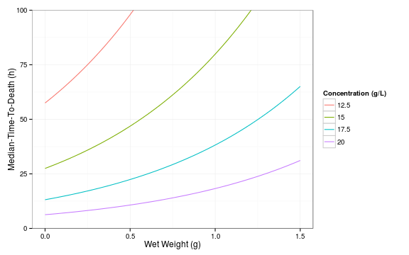
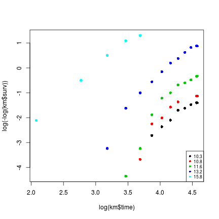

This is example 4.10 on page 180 of [Quantitative Ecotoxicology](http://www.crcpress.com/product/isbn/9781439835647). A follow-up to [example 4.9](http://edild.github.io/blog/2013/04/06/quant-ecotox-16/).

#### Data
We use data from the [previous example](http://edild.github.io/blog/2013/04/06/quant-ecotox-16/) and also convert the concentrations into a factor:

```r
# download data from github
require(RCurl)
url <- getURL("https://raw.github.com/EDiLD/r-ed/master/quantitative_ecotoxicology/data/TOXICITY.csv", 
    ssl.verifypeer = FALSE)
TOXICITY <- read.table(text = url, header = TRUE)
# add status
TOXICITY$FLAG <- ifelse(TOXICITY$TTD > 96, 1, 2)
```


#### Compare models
We can fit parametric survival time models using the `survreg()` function, where the `dist` argument specifies the assumed distribution. The Gamma distribution is not supported by `survreg` (but see below).

```r
require(survival)
# fit different models
mod_exp <- survreg(Surv(TTD, FLAG) ~ PPT + WETWT, data = TOXICITY, dist = "exponential")
mod_wei <- survreg(Surv(TTD, FLAG) ~ PPT + WETWT, data = TOXICITY, dist = "weibull")
mod_lnorm <- survreg(Surv(TTD, FLAG) ~ PPT + WETWT, data = TOXICITY, dist = "lognorm")
mod_llog <- survreg(Surv(TTD, FLAG) ~ PPT + WETWT, data = TOXICITY, dist = "loglogistic")
```


From the models we can access the Log-Likelihood via `object$loglig[2]`. Note that survreg gives 2 likelihoods, one without covariables (intercept only) and one with covariables. We are interested in the second one.

```r
# extract loglik and save into data.frame
df <- data.frame(model = c("exp", "weibull", "lnorm", "loglog"), logLik = c(mod_exp$loglik[2], 
    mod_wei$loglik[2], mod_lnorm$loglik[2], mod_llog$loglik[2]))
```


and extract the AIC-values (`extractAIC`) for model comparisons:

```r
# add AIC as column to data.frame
df$AIC <- c(extractAIC(mod_exp)[2], extractAIC(mod_wei)[2], extractAIC(mod_lnorm)[2], 
    extractAIC(mod_llog)[2])
df
```

```
##     model  logLik    AIC
## 1     exp -1309.7 2625.4
## 2 weibull -1114.3 2236.7
## 3   lnorm -1121.8 2251.5
## 4  loglog -1118.1 2244.2
```


Like with SAS the weibull-model has the lowest AIC. Not that the Log-Likelihood values differ by a constant of ~920 from SAS. Therefore also the AIC deviates by a constant of ~1840 (=2*920).


#### Inspect model
From the `summary` we get the estimates and their standard errors, as well as a Wald test for the coefficients. 


```r
summary(mod_wei)
```

```
## 
## Call:
## survreg(formula = Surv(TTD, FLAG) ~ PPT + WETWT, data = TOXICITY, 
##     dist = "weibull")
##              Value Std. Error      z         p
## (Intercept)  7.849    0.08449  92.89  0.00e+00
## PPT         -0.295    0.00512 -57.54  0.00e+00
## WETWT        1.066    0.25604   4.16  3.15e-05
## Log(scale)  -1.189    0.04455 -26.69 6.09e-157
## 
## Scale= 0.305 
## 
## Weibull distribution
## Loglik(model)= -1114.3   Loglik(intercept only)= -1606.3
## 	Chisq= 983.9 on 2 degrees of freedom, p= 0 
## Number of Newton-Raphson Iterations: 9 
## n=480 (70 observations deleted due to missingness)
```


Note that the estimate of $0.0602 \pm 0.2566$ for WETWT in the book must be a typo: The standard error is way too big to be statistically significant, so I think the R result is right here.

We see that the concentration has a negative effect on time to death and that bigger fish survive longer.


#### Plot model

From our model we can predict for any salt concentration or fish wet weight the median time to death.

To produce Figure 4.12 we first generate some new data for which we want to predict the median time to death. I use `expand.grid` here, which gives every combination of wet weight from 0 to 1g and four salt concentrations.

Then I use the `predict` function to predict for all these combinations the median-time-to-death from our model (`type='quantile', p = 0.5` specifies the median time).

Afterwards this is plotted using the [ggplot2](http://ggplot2.org/) plotting system.


```r
# newdata, all combinations of WETWT and PPT
newtox <- expand.grid(WETWT = seq(0, 1.5, length.out = 100), PPT = seq(12.5, 
    20, by = 2.5))
# predict ttd for newdata
newtox$preds <- predict(mod_wei, newdata = newtox, type = "quantile", p = 0.5)

# plot
require(ggplot2)
ggplot(newtox, aes(x = WETWT, y = preds, col = factor(PPT), group = PPT)) + 
    geom_line() + theme_bw() + labs(x = "Wet Weight (g)", y = "Median-Time-To-Death (h)", 
    col = "Concentration (g/L)") + coord_cartesian(ylim = c(0, 100))
```

 


#### Notes
We can also plot the data and the model into one plot. Here I fit a model only with concentration, for demonstration. 
We can plot the Kaplan-Meier curve as shown in previous example. Then add the model as curve using the `predict` function:


```r
# plot KM
km <- survfit(Surv(TTD, FLAG) ~ PPT, data = TOXICITY)
plot(km, col = 1:7)

# Fit model only for Concentrations
mod_ppt <- survreg(Surv(TTD, FLAG) ~ PPT, data = TOXICITY, dist = "weibull")

# add model to plot
PPT_u <- sort(unique(TOXICITY$PPT))
for (i in seq_along(PPT_u)) {
    lines(predict(mod_ppt, newdata = list(PPT = PPT_u[i]), type = "quantile", 
        p = 1:99/100), 99:1/100, col = i)
}
```

 


To produce a plot similar to Figure 4.11 we can use the following code:

```r
# opposite of %in% : 'not in'
`%!in%` <- Negate(`%in%`)

# remove 0 and 20.1 treatments
TOXICITY_sub <- TOXICITY[TOXICITY$PPT %!in% c(0, 20.1), , drop = TRUE]
# kaplan-meier estimates
km <- survfit(Surv(TTD, FLAG) ~ PPT, data = TOXICITY_sub)
fac <- factor(rep(sort(unique(TOXICITY_sub$PPT)), km$strata))
cols <- 1:5
# plot tranformed time vs. survival
plot(log(km$time), log(-log(km$surv)), col = cols[fac], pch = 16)
# add legend
legend("bottomright", legend = levels(fac), col = cols, pch = 16, cex = 0.7)
```

 


To fit a gamma distribution we have to use another package: `flexsurv`.
Usage is (intended) similar to `survival`. However the loglogistic distribution is not build in. But this can be fixed easily, see `?flexsurvreg`:


```r
#### Define loglogistic distribution for flexsurvreg
library(eha)
custom.llogis <- list(name = "llogis", pars = c("shape", "scale"), location = "scale", 
    transforms = c(log, log), inv.transforms = c(exp, exp), inits = function(t) {
        c(1, median(t))
    })
```


```r
require(flexsurv)
# fit all models using flexsurvreg
mod_flex_exp <- flexsurvreg(Surv(TTD, FLAG) ~ PPT + WETWT, data = TOXICITY, 
    dist = "exp")
mod_flex_wei <- flexsurvreg(Surv(TTD, FLAG) ~ PPT + WETWT, data = TOXICITY, 
    dist = "weibull")
mod_flex_lnorm <- flexsurvreg(Surv(TTD, FLAG) ~ PPT + WETWT, data = TOXICITY, 
    dist = "lnorm")
mod_flex_llog <- flexsurvreg(Surv(TTD, FLAG) ~ PPT + WETWT, data = TOXICITY, 
    dist = custom.llogis)
mod_flex_ggamma <- flexsurvreg(Surv(TTD, FLAG) ~ PPT + WETWT, data = TOXICITY, 
    dist = "gengamma")
```


Comparing the results from `flexsurvreg` with `survreg`, we see that the estimates are identical for all models. Therefore I conclude that `flexsurv` is an alternative when fitting with gamma distribution.

Code and data are available on my [github-repo](https://github.com/EDiLD/r-ed/tree/master/quantitative_ecotoxicology) under file name 'p180'.
