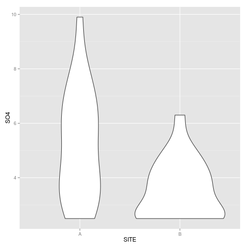

### Quantitative Ecotoxicology, page 42, example 2.4, Wilcoxon rank sum test

Get the data from [here](https://raw.github.com/EDiLD/r-ed/master/quantitative_ecotoxicology/data/p42.csv) and read it into R:


```r
SULFATE <- read.table("p42.csv", header = TRUE, sep = ";")
```


Lets first have a look at the data via a violin plot:

```r
require(ggplot2)
ggplot(SULFATE, aes(x = SITE, y = SO4)) + geom_violin()
```

 


It is quite easy to perform a wilcoxon-test with the function wilcox.test:

```r
wilcox.test(SO4 ~ SITE, data = SULFATE, correct = TRUE)
```

```
## Warning: cannot compute exact p-value with ties
```

```
## 
## 	Wilcoxon rank sum test with continuity correction
## 
## data:  SO4 by SITE 
## W = 330.5, p-value = 0.00563
## alternative hypothesis: true location shift is not equal to 0
```

It works with the usual formula-notation, additional I specified the continuity correction.
For a one-sided test we can specify the argument 'alternative':

```r
wilcox.test(SO4 ~ SITE, data = SULFATE, correct = TRUE, alternative = "greater")
```

```
## Warning: cannot compute exact p-value with ties
```

```
## 
## 	Wilcoxon rank sum test with continuity correction
## 
## data:  SO4 by SITE 
## W = 330.5, p-value = 0.002815
## alternative hypothesis: true location shift is greater than 0
```


The p-values are the same as with SAS, however we get a warning since we have ties in our data (I don't know how SAS handles this):
> cannot compute exact p-value with ties

If we want to compute exact p-values in the presence of ties, we could use wilcox_test() from the coin package: 


```r
require(coin)
wilcox_test(SO4 ~ SITE, SULFATE, distribution = "exact", conf.int = TRUE)
```

```
## 
## 	Exact Wilcoxon Mann-Whitney Rank Sum Test
## 
## data:  SO4 by SITE (A, B) 
## Z = 2.781, p-value = 0.004727
## alternative hypothesis: true mu is not equal to 0 
## 95 percent confidence interval:
##  0.4 2.8 
## sample estimates:
## difference in location 
##                    1.5
```

Here I also specified to output the 95%-Confidence-Interval via the 'conf.int argument.

Code and data are available at my [github-repo](https://github.com/EDiLD/r-ed/tree/master/quantitative_ecotoxicology) under file name 'p42'.
