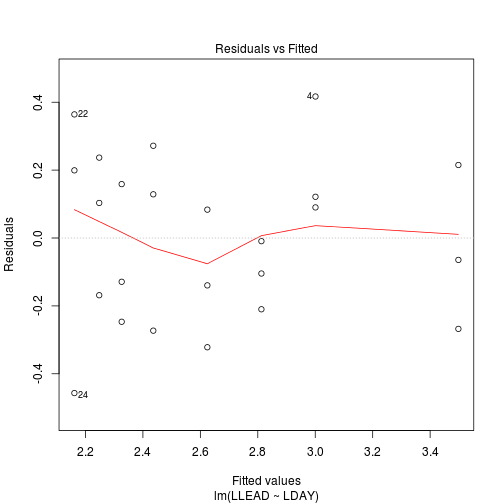

### Quantitative Ecotoxicology, Page 94, Example 3.5


Get the data from [here](https://raw.github.com/EDiLD/r-ed/master/quantitative_ecotoxicology/data/p94.csv) and read it into R:


```r
LEAD <- read.table("p94.csv", header = TRUE, sep = ";")
```


```r
head(LEAD)
```

```
##    DAY LEAD
## 1 0.16 41.0
## 2 0.16 31.0
## 3 0.16 25.3
## 4 1.00 30.5
## 5 1.00 22.7
## 6 1.00 22.0
```


As always we first take a look at the data:

```r
plot(LEAD ~ DAY, LEAD)
```

 


A simple power model may fit the data:

$$C_t = C_1~t^{−P}$$

We could fit such model as in example 3.3 via Nonlinear Least Squares or we could try to linearize the relationship by a ln-transform  of both DAY and LEAD:


```r
LEAD$LLEAD <- log(LEAD$LEAD)
LEAD$LDAY <- log(LEAD$DAY)
plot(LLEAD ~ LDAY, LEAD)
```

 


Now we can us lm() to estimate the coefficients and check our model:


```r
# fit model
mod <- lm(LLEAD ~ LDAY, data = LEAD)
```


The residuals show no pattern:

```r
plot(mod, which = 1)
```

 


From the model-output:

```r
mod_sum <- summary(mod)
mod_sum
```

```
## 
## Call:
## lm(formula = LLEAD ~ LDAY, data = LEAD)
## 
## Residuals:
##     Min      1Q  Median      3Q     Max 
## -0.4568 -0.1789  0.0372  0.1689  0.4169 
## 
## Coefficients:
##             Estimate Std. Error t value Pr(>|t|)    
## (Intercept)   3.0008     0.0641   46.80  < 2e-16 ***
## LDAY         -0.2715     0.0313   -8.67  1.5e-08 ***
## ---
## Signif. codes:  0 '***' 0.001 '**' 0.01 '*' 0.05 '.' 0.1 ' ' 1 
## 
## Residual standard error: 0.238 on 22 degrees of freedom
## Multiple R-squared: 0.773,	Adjusted R-squared: 0.763 
## F-statistic: 75.1 on 1 and 22 DF,  p-value: 1.53e-08
```


We see that out fitted model hast the formula:
$$Ln(LEAD) = 3.0008 - 0.272 ln(DAY)$$
with an R-squared of 0.77 and is statistically significant. The standard errors for the two parameters are 0.064 and 0.031.

So our backtransformed model would be:
$$ LEAD = exp(3.0008)~Day^{-0.272} = 20.68~Day^{-0.272}$$

Finally we can also plot our model:

```r
plot(LLEAD ~ LDAY, LEAD)
abline(mod)
```

 


Code and data are available at my [github-repo](https://github.com/EDiLD/r-ed/tree/master/quantitative_ecotoxicology) under filename 'p94'.

